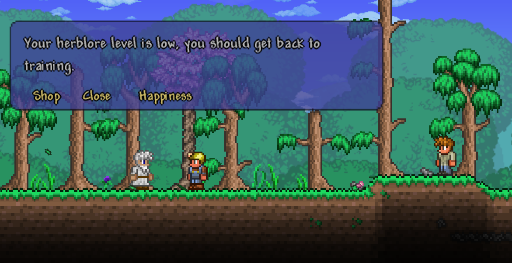
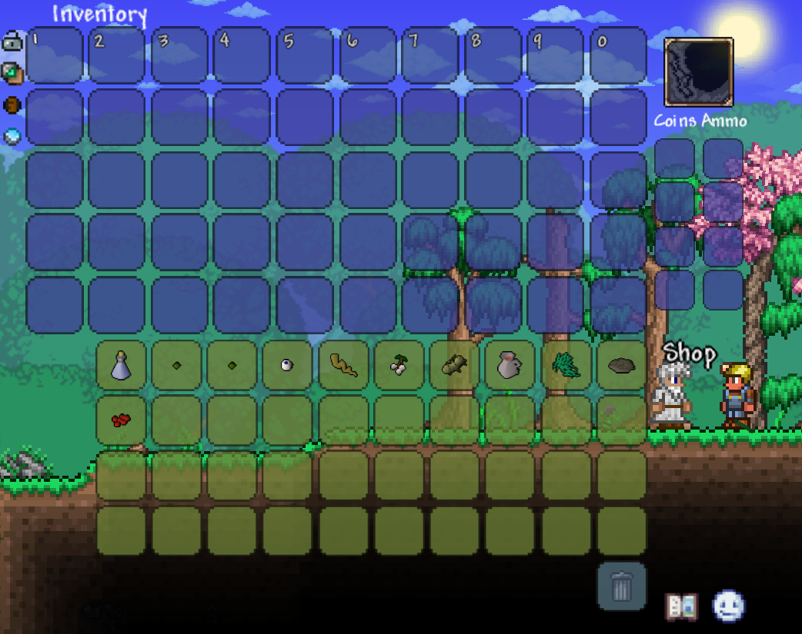
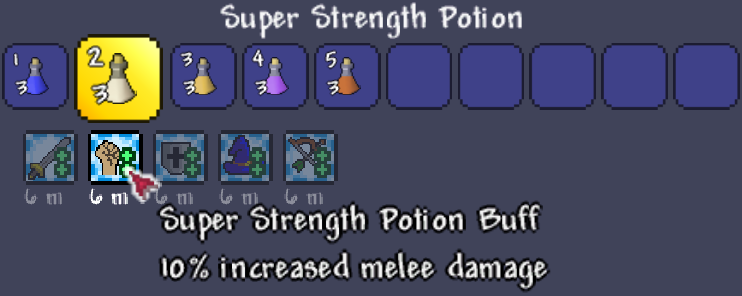
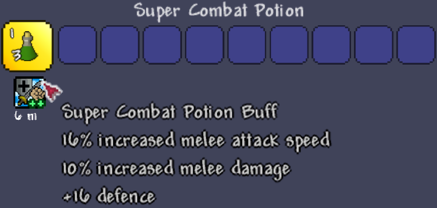

# OSRS Potions

Adds potions from Old School RuneScape (OSRS) to Terraria! For use with [tModLoader](https://www.tmodloader.net/).

## How Does it Work?

After killing King Slime or the Eye of Cthulhu, a Guthixian Druid will arrive in your world. Buy seeds to grow guam plants; then, buy vials and secondary ingredients to mix powerful potions from the world of Gielinor. Use attack, strength, defence, magic, and ranging potions to boost your combat prowess and defeat your enemies, and drink prayer potions to recover your mana!

Once you reach hardmode, the Druid wil sell snapdragon seeds, unlocking a new tier of even more powerful potions. Super attack, strength, defence, magic, and ranging potions give double the boost of their pre-hardmode counterparts; plus, Saradomin Brews and Super Restores restore your health and mana with an extra bonus on top!

## Potions Added

Potions are crafted with a vial of water, a guam or snapdragon leaf (grown from seeds), and a secondary ingredient. Each craft outputs three doses, and each dose lasts 6 minutes. Note that potions of the same type don't stack: for example, a super attack potion will override the buff from an attack potion.

### Pre-Hardmode

Pre-hardmode potions are crafted with guam and a secondary ingredient.

| Potion | Ingredient | Effect |
| --- | --- | --- |
| Attack potion | Eye of newt | +8% melee attack speed |
| Strength potion | Limpwurt root | +5% melee damage |
| Defence potion | White berries | +8 defence |
| Magic potion | Potato cactus | +5% magic damage |
| Ranging potion | Wine of Zamorak | +5% ranged damage |
| Prayer potion | Snape grass | Restores 120 mana | 

Hardmode potions are crafted with snapdragon and a secondary ingredient.
    
| Potion | Ingredient | Effect |
| --- | --- | --- |
| Super attack potion | Eye of newt | +16% melee attack speed |
| Super strength potion | Limpwurt root | +10% melee damage |
| Super defence potion | White berries | +16 defence |
| Ancient brew | Potato cactus | +10% magic damage and +40 max mana |
| Super ranging potion | Wine of Zamorak | +10% ranged damage and +5% ranged crit chance |
| Super restore | Red spiders' eggs | Restores 250 mana and removes stat-reducing debuffs including slow, chilled, weak, and broken armor |
| Saradomin brew | Crushed nest | Restores 160 health and gives a super defence buff for one minute |
| Super combat potion | Super attack, strength, and defence | Combines the effects of a super attack, strength, and defence potion |

## Screenshots

### Guthixian Druid NPC

### New Plantable Herbs

### New Buffs

### New Items

